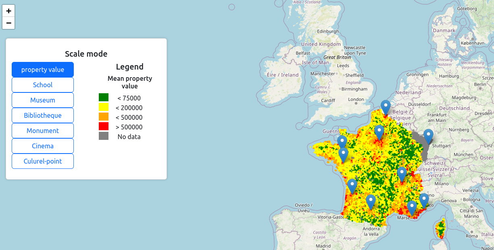

# Cultural-Quotient-Homes

Cultural-Quotient-Homes: Analyzing the Nexus between Real Estate Prices and Cultural Hotspots

## Result file

You can found to to result file from our work the first is :

```
out.json
```

That is a json represenation of the treatement  of all the data source that you can find below

and :

```
result.geojson 
```

That is a representation of our result that include the polygon reprsenting the french commune in a GeoJson FeatureCollestion.

## Visualisation of our result

You can visualise the result of our work with a simple web client that you locaaly launch with the following CLI

```
cd gui 
npm install 
npm start 
```



## Data source

### Schools

[*Adresse et géolocalisation des établissements d'enseignement du premier et second degrés*](https://www.data.gouv.fr/fr/datasets/adresse-et-geolocalisation-des-etablissements-denseignement-du-premier-et-second-degres-1/#/resources/b3b26ad1-a143-4651-afd6-dde3908196fc) on data.gouv.fr

### Museum list

[*List of french museum*](https://data.culture.gouv.fr/explore/dataset/liste-et-localisation-des-musees-de-france/api/?disjunctive.region_administrative&disjunctive.departement) on data.gouv.fr

### Museum attendance

[*Attendance of the frenc museum*](https://data.culture.gouv.fr/explore/dataset/liste-et-localisation-des-musees-de-france/api/?disjunctive.region_administrative&disjunctive.departement) on data.gouv.fr

### cinema list

[*LIst of french cinema*](https://data.culture.gouv.fr/explore/dataset/etablissements-cinematographiques/api/) on data.gouv.fr

### cinema attendance

[*Attendance of french cinema*](https://data.culture.gouv.fr/explore/dataset/frequentation-dans-les-salles-de-cinema/api/?disjunctive.annee) on data.gouv.fr

### Property value

 [propertie values for the year 2021 in France](https://www.data.gouv.fr/fr/datasets/demandes-de-valeurs-foncieres/) on data.gouv.fr

### GeoJson of french commune

[GeoJson representation of french commune ](https://github.com/gregoiredavid/france-geojson/)

on github
